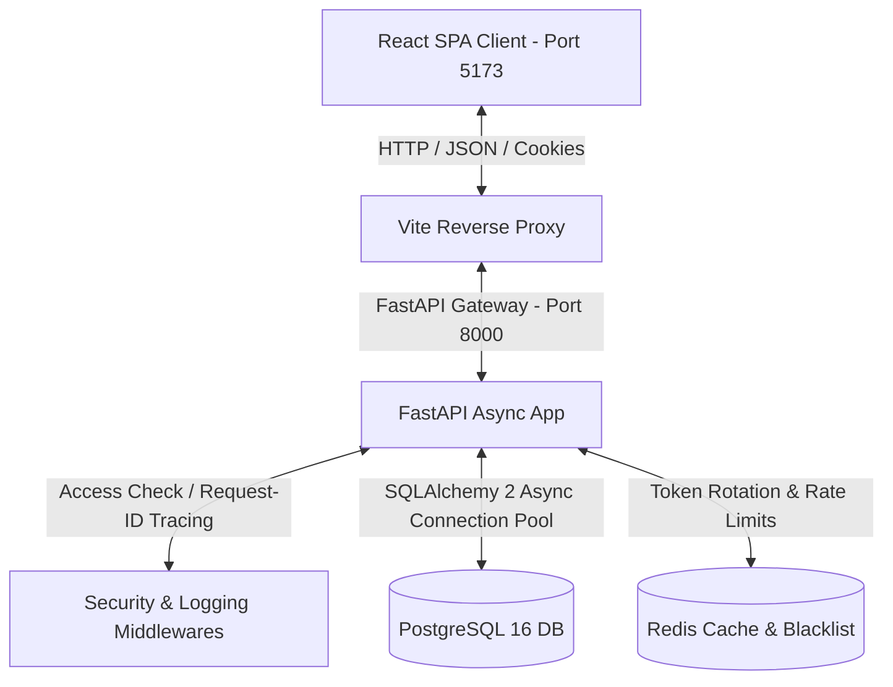

# AI BusinessOS - Enterprise SaaS ERP Foundation

AI BusinessOS is a production-grade, highly scalable, and modular project foundation designed for Small & Medium Businesses. It uses a Clean Architecture approach to separate concerns and ensure maintainability for years of future development.

---

## 1. System Architecture

Below is the interaction flow between the glassmorphic SPA React frontend, the FastAPI async backend, PostgreSQL connection pool, and the Redis caching/security indexes:



---

## 2. Directory Layout

The workspace is organized as follows:

```
AI BusinessOS/
├── .github/
│   └── workflows/
│       └── ci.yml             # Lint & Test CI Action
├── backend/
│   ├── alembic/
│   │   ├── versions/          # Database migrations versioning
│   │   └── env.py
│   ├── app/
│   │   ├── api/v1/            # API Route handlers (Auth, Health)
│   │   ├── auth/              # JWT, hashing, and RBAC dependencies
│   │   ├── config/            # Settings management
│   │   ├── database/          # Session managers & Connection pooling
│   │   ├── exceptions/        # Custom exceptions & global handlers
│   │   ├── logging/           # structlog JSON logs config
│   │   ├── middleware/        # Tracing, Rate limits, Security Headers
│   │   ├── models/            # SQLAlchemy models (AuditBase, User)
│   │   ├── repositories/      # Repository pattern files
│   │   ├── schemas/           # Pydantic validation schemas
│   │   └── tests/             # pytest suite (conftest, auth tests)
│   ├── alembic.ini
│   ├── Dockerfile
│   ├── pyproject.toml         # Ruff & pytest configs
│   ├── requirements.txt
│   └── seed.py                # Database role seeding script
├── frontend/
│   ├── src/
│   │   ├── assets/            # Static assets
│   │   ├── components/        # Shared components
│   │   ├── contexts/          # Auth & Theme states
│   │   ├── layouts/           # Sidebar / navbar layout shell
│   │   ├── pages/             # Route pages (Landing, Login, Dashboard)
│   │   ├── styles/            # CSS Base styles
│   │   ├── types/             # TypeScript files
│   │   ├── utils/             # Helper formatters
│   │   ├── App.tsx            # Main routes
│   │   └── main.tsx
│   ├── Dockerfile
│   ├── index.html
│   ├── package.json
│   ├── postcss.config.js
│   ├── tailwind.config.js
│   ├── tsconfig.json
│   └── vite.config.ts
├── .env.dev                   # Local development variables
├── .env.prod                  # Production variables
├── .env.test                  # Test suite variables
├── docker-compose.yml
└── Makefile                   # Developer CLI targets
```

---

## 3. Quickstart & Installation

### Prerequisites
- Install **Docker** and **Docker Compose** on your system.
- Install **Make** (standard utility).

### 1. Build and Run Containers
To download images, build, and boot the containers in the background, run:
```bash
make up
```

### 2. Run Database Migrations
Create the `users` table layout using Alembic:
```bash
make migrate
```

### 3. Seed Users Database
Initialize test accounts across all system roles (Super Admin, Admin, Manager, HR, Finance, Sales, Employee):
```bash
make seed
```
> [!NOTE]
> Seeding creates users with their emails (e.g. `superadmin@businessos.com`) and default password: **`SuperSecurePassword123!`**.

### 4. Run Test Suite
Validate the endpoints, JWT rotations, and health modules using pytest with coverage reports:
```bash
make test
```

### 5. Stop Containers
```bash
make down
```

---

## 4. Development Environment Variables

The configuration settings are separate for each environment scope:
- **`.env.dev`**: Loaded automatically during docker compose operations.
- **`.env.test`**: Loaded during pytest executions.
- **`.env.prod`**: Preconfigured defaults for live environments.

### Core Variables

| Variable | Description | Default |
| :--- | :--- | :--- |
| `ENVIRONMENT` | Target runtime environment | `development` / `production` / `testing` |
| `DATABASE_URL` | SQLAlchemy connection string | `postgresql+asyncpg://postgres:postgrespassword@db:5432/ai_businessos_dev` |
| `REDIS_URL` | Redis cache connection string | `redis://redis:6379/0` |
| `JWT_SECRET_KEY` | HS256 secret key for signing access tokens | *Secure Hex Value* |
| `JWT_REFRESH_SECRET_KEY` | HS256 secret key for signing refresh tokens | *Secure Hex Value* |
| `ACCESS_TOKEN_EXPIRE_MINUTES`| Expiry period of Access JWTs | `60` |
| `REFRESH_TOKEN_EXPIRE_DAYS` | Expiry period of Refresh JWTs | `7` |

---

## 5. Security & Authentication Flow

AI BusinessOS implements a highly secure, modern authentication scheme:
1. **Double Token Delivery**: On login, the backend issues an Access Token (sent via standard response JSON and a secure `HttpOnly`, `Secure`, `SameSite=Lax` Cookie) and a Refresh Token (returned in the response JSON).
2. **Access Token Verification**: Middlewares inspect authorization headers (Bearer token) or check for cookies to authenticate requests.
3. **Refresh Token Rotation (RTR)**: When the client access token expires, a POST to `/refresh` rotates BOTH tokens. The old refresh token is blacklisted in Redis with a TTL matching its remaining lifespan. Any subsequent attempt to reuse an old refresh token is flagged as a replay attack, blacklisted, and access is revoked.
4. **Rate Limiting**:
   - Global rate limit: 100 requests per minute per IP.
   - Login endpoint: Max 10 attempts per hour.
   - Password recovery endpoint: Max 5 attempts per hour.

---

## 6. Project Roadmap & Future Modules

AI BusinessOS provides a solid foundation. Future modules will plug in directly:
- **Employee Hub**: Human Resource records, timesheets, payroll tracking, and org charts.
- **Stock & Inventory**: Multi-warehouse inventories, SKU management, suppliers, and order fulfillment.
- **CRM & Client Hub**: Funnels, leads pipelines, contact trackers, and customer interactions logging.
- **AI Core Automation**: AI workflows for automated report generation, invoice processing, and predict analytics.
